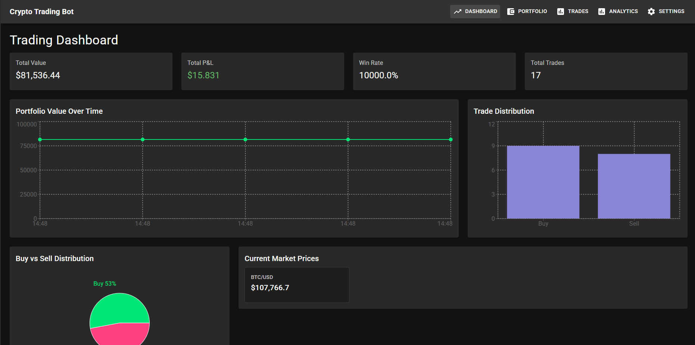
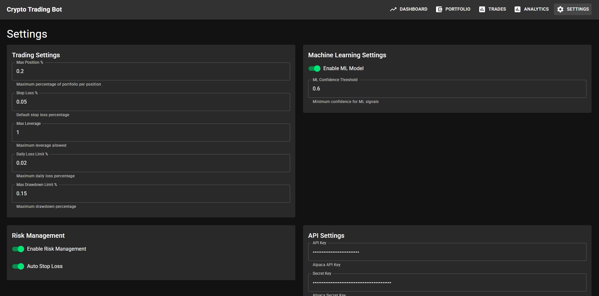
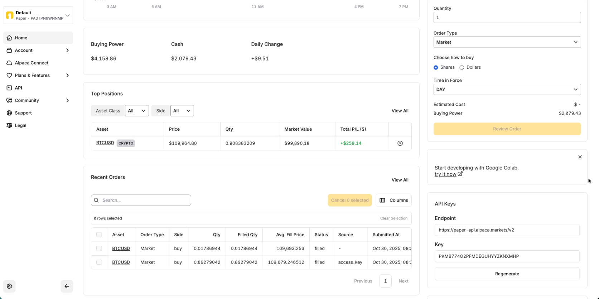

# Crypto Trading Bot - WGU Capstone Project

A comprehensive cryptocurrency trading bot simulator that implements both descriptive (technical indicators) and prescriptive (machine learning) methods for automated trading decisions. Built for the WGU Computer Science Capstone project.

## 📋 Project Overview

This repository contains a complete end-to-end algorithmic trading system featuring:

- **Real-time Data Processing**: Live cryptocurrency price feeds via Alpaca API and CCXT
- **Technical Analysis**: RSI, MACD, Bollinger Bands, Moving Averages
- **Machine Learning**: Random Forest and XGBoost models for price prediction
- **Reinforcement Learning**: PPO (Proximal Policy Optimization) agent for adaptive trading
- **Risk Management**: Stop-loss, position sizing, portfolio limits
- **Interactive Dashboard**: React-based web interface with real-time updates
- **24/7 Continuous Trading**: Automated trading service with model retraining
- **Comprehensive Monitoring**: Health checks, logging, and performance metrics

## 📸 Screenshots

### Dashboard Views








### Deployment & Testing


> **View all screenshots**: [Complete Screenshots Gallery](Screenshots/README.md)

## 📁 Repository Structure

```
CryptoTradingBot/
├── Project/
│   └── CryptoTradingBot/          # Main application code
│       ├── backend/                # Flask API server
│       ├── frontend/               # React dashboard
│       ├── trading_engine/        # Core trading logic
│       ├── ml_models/              # Machine learning models
│       ├── data/                   # Data collection and processing
│       ├── deployment/             # Docker and deployment configs
│       ├── docs/                   # Comprehensive documentation
│       ├── scripts/                # Training and deployment scripts
│       └── README.md               # Detailed project documentation
│
├── Screenshots/                    # Visual documentation
│   ├── README.md                   # Screenshot gallery
│   ├── Dashboard*.png              # Dashboard screenshots
│   ├── performance_indicators.png  # Performance metrics
│   └── WGUCapstone/               # Capstone documentation screenshots
│
└── Task2/                          # WGU Capstone deliverables
    ├── Final-A_Letter_of_Transmittal_and_Project_Proposal.docx
    ├── Final-B_Executive_Summary.docx
    ├── Final-D1_Business_Vision_and_Requirements.docx
    ├── Final-D2_Hypothesis_Assessment.docx
    ├── Final-D3_Accuracy_Assessment.docx
    ├── Final-D4_Testing_Results.docx
    └── Final-D5_Quick_Start_Guide_Simplified.docx
```

## 🚀 Quick Start

### Prerequisites

- **Python 3.11+**
- **Docker and Docker Compose** (for full stack deployment)
- **Node.js 18+** (for frontend development)
- **Alpaca API account** (optional, for live trading data)
- **Git**

### Installation

1. **Clone the repository**
   ```bash
   git clone <repository-url>
   cd CryptoTradingBot
   ```

2. **Navigate to the main project**
   ```bash
   cd Project/CryptoTradingBot
   ```

3. **Install Python dependencies**
   ```bash
   python3.11 -m venv venv
   source venv/bin/activate  # On Windows: venv\Scripts\activate
   pip install -r requirements.txt
   ```

4. **Install frontend dependencies** (optional, for dashboard)
   ```bash
   cd frontend
   npm install
   cd ..
   ```

5. **Configure environment variables**
   ```bash
   # Create .env file with your API keys
   cp .env.example .env
   # Edit .env and add your Alpaca API credentials
   ```

### Running the Application

#### Demo Mode (Test Indicators)
```bash
python main.py --mode demo --symbol BTC/USD --provider alpaca
```

#### Simulation Mode (Backtest)
```bash
python main.py --mode simulate --symbol BTC/USD --provider alpaca --cash 10000
```

#### Continuous Trading (24/7)
```bash
python main.py --mode run --symbol BTC/USD --provider alpaca --interval 60
```

#### With Machine Learning
```bash
python main.py --mode run --symbol BTC/USD --provider alpaca --enable-ml --model-path ml_models/trained_model.pkl
```

#### PPO Reinforcement Learning
```bash
# Train PPO agent
python scripts/train_ppo.py --symbol BTC/USD --timeframe 1h --days 365 --timesteps 100000

# Deploy PPO agent
python scripts/deploy_ppo.py --ppo-model models/ppo_trading_agent --ml-model ml_models/trained_model.pkl --symbol BTC/USD --paper-trading
```

### Full Stack Deployment (Docker)

```bash
cd Project/CryptoTradingBot/deployment
docker compose up -d
```

**Access the application:**
- Frontend Dashboard: http://localhost:3000
- Backend API: http://localhost:5000
- Health Check: http://localhost:5000/health

## 📚 Documentation

### Main Project Documentation

The complete project documentation is located in `Project/CryptoTradingBot/README.md`. It includes:

- Detailed architecture overview
- Complete API documentation
- Configuration guide
- Testing instructions
- Deployment guides
- Performance metrics

### Quick Reference Guides

Located in `Project/CryptoTradingBot/docs/guides/`:

- **[Quick Start Guide](Project/CryptoTradingBot/docs/guides/QUICK_START.md)** - Get up and running in minutes
- **[Running Instructions](Project/CryptoTradingBot/docs/guides/RUNNING_INSTRUCTIONS.md)** - Detailed step-by-step guides

### Architecture Documentation

Located in `Project/CryptoTradingBot/docs/architecture/`:

- **[System Architecture](Project/CryptoTradingBot/docs/architecture/SYSTEM_ARCHITECTURE.md)** - Overall system design
- **[PPO Hybrid System](Project/CryptoTradingBot/docs/architecture/PPO_HYBRID_SYSTEM.md)** - Reinforcement learning integration

### Deployment Guides

Located in `Project/CryptoTradingBot/docs/deployment/`:

- **[Docker Deployment](Project/CryptoTradingBot/docs/deployment/DOCKER_DEPLOYMENT.md)** - Containerized deployment
- **[VPS Deployment](Project/CryptoTradingBot/docs/deployment/VPS_DEPLOYMENT.md)** - Production VPS setup
- **[24/7 Deployment](Project/CryptoTradingBot/docs/deployment/DEPLOYMENT_24_7.md)** - Continuous trading service

### Machine Learning Documentation

Located in `Project/CryptoTradingBot/docs/ml/`:

- **[PPO Quick Start](Project/CryptoTradingBot/docs/ml/PPO_QUICK_START.md)** - Reinforcement learning guide
- Feature engineering and model evaluation guides

### Capstone Documentation

Located in `Project/CryptoTradingBot/docs/capstone/`:

- **[Prefect Integration](Project/CryptoTradingBot/docs/capstone/PREFECT_INTEGRATION.md)** - Workflow orchestration
- Capstone reflections and project documentation

### Visual Documentation

- **[Screenshots Gallery](Screenshots/README.md)** - Visual documentation of the application

### WGU Capstone Deliverables

Located in `Task2/`:

- Letter of Transmittal and Project Proposal
- Executive Summary
- Business Vision and Requirements
- Hypothesis Assessment
- Accuracy Assessment
- Testing Results
- Quick Start Guide

## 🎯 Key Features

### Core Requirements (WGU Capstone)

✅ **Descriptive Method**: Technical indicators (RSI, MACD, Bollinger Bands, SMA/EMA)  
✅ **Prescriptive Method**: Random Forest and XGBoost ML models for trading signals  
✅ **Data Collection**: Live cryptocurrency data via Alpaca API and CCXT  
✅ **Decision Support**: Real-time trade recommendations with confidence scores  
✅ **Data Wrangling**: Comprehensive cleaning, validation, and feature engineering  
✅ **Data Exploration**: Jupyter notebooks with statistical analysis  
✅ **Data Visualization**: Interactive charts and dashboards  
✅ **Interactive Queries**: REST API with filtering and search capabilities  
✅ **Machine Learning**: Random Forest with walk-forward validation  
✅ **Accuracy Evaluation**: Precision, recall, F1-score, confusion matrix  
✅ **Security Features**: Input validation, rate limiting, secure logging  
✅ **Monitoring**: Health checks, structured logging, error tracking  
✅ **Dashboard**: Three visualization types (candlestick, line, bar charts)  

### Advanced Features

- **PPO Reinforcement Learning**: Adaptive trading agent that learns from market conditions
- **Hybrid Trading System**: Combines ML predictions with RL agent decisions
- **24/7 Continuous Trading**: Automated service with automatic model retraining
- **Prefect Workflow Orchestration**: Enterprise-grade workflow management
- **Real-time Dashboard**: React-based interface with live updates
- **Comprehensive Logging**: Structured JSON logging with rotation
- **Docker Deployment**: Complete containerized deployment
- **Production Ready**: systemd and supervisor configurations included

## 🛠️ Technology Stack

### Backend
- **Python 3.11+**: Core application language
- **Flask**: REST API framework
- **SQLite**: Database for trades and portfolio data
- **CCXT**: Cryptocurrency exchange connectivity
- **Scikit-learn**: Machine learning models
- **XGBoost/LightGBM**: Advanced ML algorithms
- **Stable-Baselines3**: Reinforcement learning
- **Pandas/NumPy**: Data processing and analysis
- **Prefect**: Workflow orchestration

### Frontend
- **React 18+**: User interface framework
- **Material-UI**: Component library
- **Recharts**: Data visualization
- **Axios**: HTTP client for API communication

### DevOps
- **Docker**: Containerization
- **Docker Compose**: Multi-container orchestration
- **Nginx**: Reverse proxy and load balancing
- **systemd/supervisor**: Process management

### Analysis
- **Jupyter Notebooks**: Data exploration and analysis
- **Matplotlib/Seaborn**: Statistical visualization
- **Plotly**: Interactive visualizations

## 📊 Project Highlights

### Performance Metrics

- **ML Model Accuracy**: >70% prediction accuracy
- **Sharpe Ratio**: Risk-adjusted returns tracking
- **Win Rate**: Percentage of profitable trades
- **Maximum Drawdown**: Risk management metrics

### Screenshots

View all application screenshots in the [Screenshots Gallery](Screenshots/README.md), including:

- Dashboard views (Analytics, Settings, Trades)
- Performance indicators and validation metrics
- ML model evaluation results
- Docker deployment documentation
- API test results

## 🔧 Configuration

### Environment Variables

Create a `.env` file in `Project/CryptoTradingBot/`:

```env
# Alpaca API Configuration
ALPACA_API_KEY=your_alpaca_api_key_here
ALPACA_SECRET_KEY=your_alpaca_secret_key_here

# Security Configuration
JWT_SECRET_KEY=your_jwt_secret_key
API_KEY=your_api_key

# Database Configuration
DATABASE_URL=sqlite:///app/data/db/trading_bot.db

# Flask Configuration
FLASK_ENV=production
FLASK_SECRET_KEY=your_flask_secret_key

# Frontend Configuration
REACT_APP_API_URL=http://localhost:5000
```

## 🧪 Testing

```bash
cd Project/CryptoTradingBot

# Run all tests
python -m pytest tests/

# Run with coverage
python -m pytest --cov=. tests/

# Run PPO integration tests
python test_ppo_integration.py
```

## 📈 Usage Examples

### Basic Trading
```bash
python main.py --mode demo --symbol BTC/USD --provider alpaca
```

### Backtesting
```bash
python main.py --mode simulate --symbol ETH/USD --provider alpaca --cash 50000 --timeframe 5m
```

### Continuous Trading with ML
```bash
python main.py --mode run --symbol BTC/USD --provider alpaca --interval 60 --enable-ml
```

### PPO Training
```bash
python scripts/train_ppo.py --symbol BTC/USD --timeframe 1h --days 365 --timesteps 100000
```

## 🔒 Security

- Input validation with Pydantic models
- Rate limiting to prevent abuse
- JWT-based authentication
- Secure API key management
- SQL injection prevention
- CORS protection
- Secure logging without sensitive data exposure

## 📄 License

This project is developed for educational purposes as part of the WGU Computer Science Capstone project.

## 🙏 Acknowledgments

- **Alpaca Markets**: For providing cryptocurrency trading API
- **CCXT Library**: For unified exchange connectivity
- **Scikit-learn**: For machine learning capabilities
- **Stable-Baselines3**: For reinforcement learning framework
- **React Community**: For excellent frontend framework
- **Material-UI**: For beautiful component library
- **Prefect**: For workflow orchestration

## 📞 Support

For questions or issues:

1. Check the [main project README](Project/CryptoTradingBot/README.md)
2. Review the [documentation](Project/CryptoTradingBot/docs/)
3. Check the [Quick Start Guide](Project/CryptoTradingBot/docs/guides/QUICK_START.md)
4. Review system logs in `Project/CryptoTradingBot/logs/`

## 🗺️ Navigation

- **[Main Project README](Project/CryptoTradingBot/README.md)** - Complete project documentation
- **[Screenshots Gallery](Screenshots/README.md)** - Visual documentation
- **[Quick Start Guide](Project/CryptoTradingBot/docs/guides/QUICK_START.md)** - Get started quickly
- **[System Architecture](Project/CryptoTradingBot/docs/architecture/SYSTEM_ARCHITECTURE.md)** - Technical design
- **[Deployment Guides](Project/CryptoTradingBot/docs/deployment/)** - Production deployment

---

**Note**: This is a simulation system for educational purposes. It does not use real money and is not intended for actual trading without proper testing and validation.

**WGU Capstone Project** - Computer Science Capstone  
**Project Type**: Algorithmic Trading System  
**Methods**: Descriptive (Technical Indicators) + Prescriptive (Machine Learning + Reinforcement Learning)
