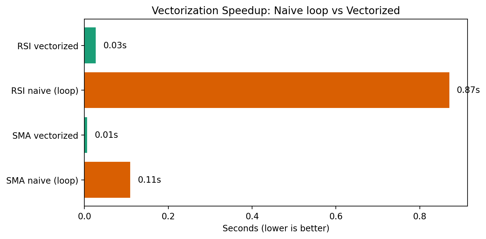
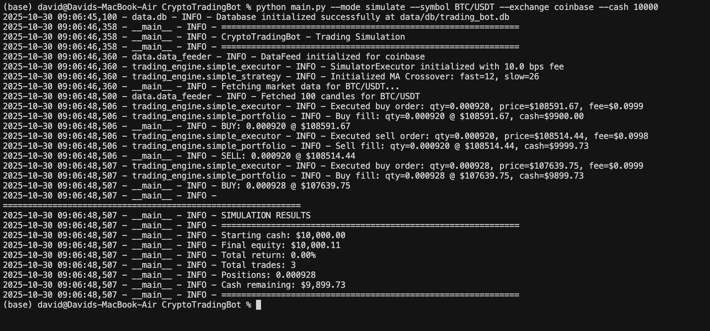

# Screenshots Gallery

This directory contains screenshots of the Crypto Trading Bot application, including dashboard views, performance metrics, validation results, and deployment documentation.

## Dashboard Screenshots

### Main Dashboard

### Dashboard Views

### Dashboard Analytics

### Dashboard Settings

### Dashboard Trades

### Alpaca Paper Trade Dashboard

## Performance & Validation Metrics

### Performance Indicators

### Validation Indicators

### ML Validation Metrics

## Development & Optimization

### Optimization - Vectorization

### Bug Fix - RSI NaN

### General Screenshot

### Screenshot 2025-11-02

## WGU Capstone Documentation

### Docker Deployment

### Task 2.2 API Tests

#### API Test Screenshot 1

#### API Test Screenshot 2

#### API Test Screenshot 3

#### API Test Screenshot 4

#### API Test Screenshot 5

#### API Test Screenshot 6

## Screenshot Index

### Root Level Screenshots
- `1.png` - General screenshot
- `alpaca_paper_trade_dashboard.png` - Alpaca paper trading dashboard view
- `bugfix_rsi_nan.png` - RSI NaN bug fix visualization
- `Dashboard-Analytics.png` - Analytics dashboard view
- `Dashboard-Settings.png` - Settings dashboard view
- `Dashboard-Trades2.png` - Trades dashboard view
- `Dashboard.png` - Main dashboard
- `Dashboard1.png` - Dashboard view 1
- `Dashboard2.png` - Dashboard view 2
- `Dashboard3-Trades.png` - Trades dashboard view 3
- `optimization_vectorization.png` - Vectorization optimization results
- `performance_indicators.png` - Performance metrics visualization
- `Screenshot 2025-11-02 160425.png` - Screenshot from November 2, 2025
- `validation_indicators.png` - Validation metrics visualization
- `validation_ml_metrics.png` - ML validation metrics

### WGUCapstone Directory
- `Docker.png` - Docker deployment overview
- `Docker Details.png` - Detailed Docker configuration

### Task2.2 API Tests Directory
- `Screenshot 2025-10-31 131446.png` - API test result 1
- `Screenshot 2025-10-31 131546.png` - API test result 2
- `Screenshot 2025-10-31 131640.png` - API test result 3
- `Screenshot 2025-10-31 131702.png` - API test result 4
- `Screenshot 2025-10-31 132637.png` - API test result 5
- `Screenshot 2025-10-31 132822.png` - API test result 6

